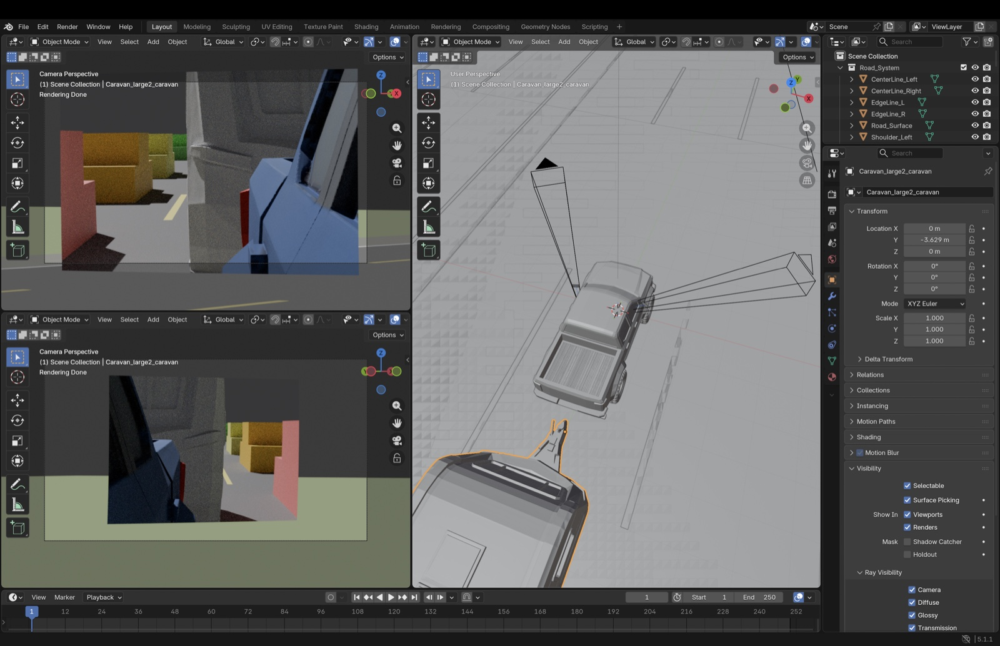

# VMirror-SiM

车辆拖拽后视镜视野仿真。



## Quick start

```bash
# Python env (conda, single source of truth)
conda env create -f environment.yml && conda activate vmirror-sim

# Then make sure Blender (5.x) is installed at /Applications/Blender.app or in PATH.

# Render a scene end-to-end
python3 -c "
from src import SimulationPipeline
SimulationPipeline(
    scene='lane_change', vehicle='hilux', caravan='large2',
    mirror='standard', camera_side='L',
    output_png='output/render-results/hilux.png',
).run()
"
```

See [docs/pipeline.md](docs/pipeline.md) for the full guide and
[CHANGELOG.md](CHANGELOG.md) for capabilities.
