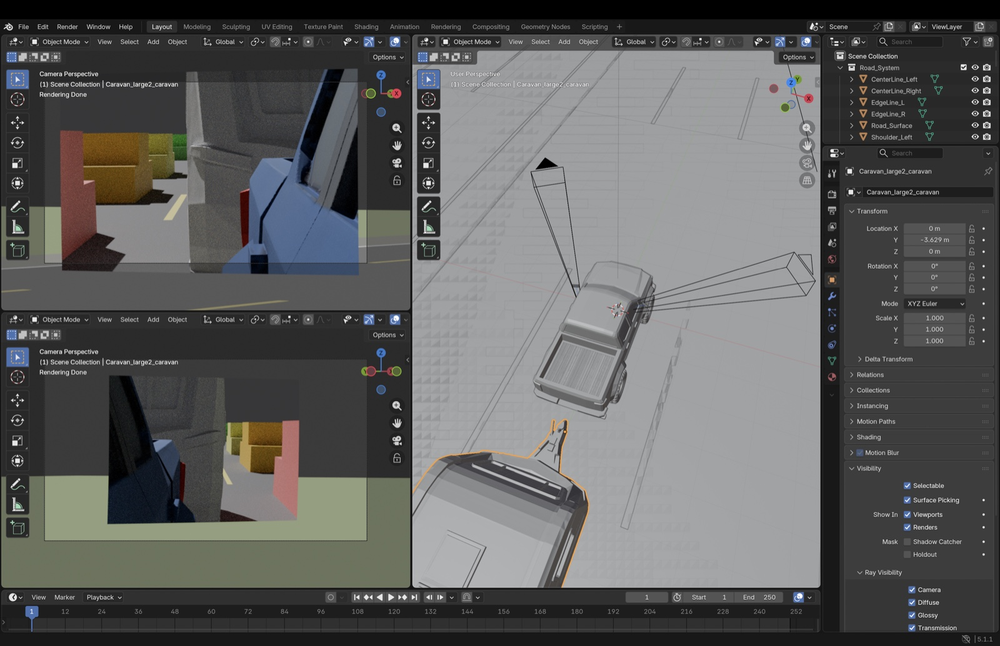

# VMirror-SiM

车辆拖拽后视镜视野仿真。



## Quick start

```bash
# Python env (conda, single source of truth)
conda env create -f environment.yml && conda activate vmirror-sim

# Install the same Blender 5.x release on macOS and Linux.
# macOS: /Applications/Blender.app; Linux: blender on PATH.
# Optional custom location: export VMIRROR_BLENDER_EXE=/path/to/blender
# Copy the gitignored vehicle/caravan assets to the other computer first.

# Render a scene end-to-end
python3 -c "
from src import SimulationPipeline
SimulationPipeline(
    scene='lane_change', vehicle='hilux', caravan='large2',
    mirror='standard', camera_side='L',
    output_png='output/render-results/hilux.png',
).run()
"
```

See [docs/pipeline.md](docs/pipeline.md) for the full guide and
[CHANGELOG.md](CHANGELOG.md) for capabilities.

## macOS + Linux

日常使用直接调用 **Python API**，macOS 和 Linux 共用相同代码与配置。
Notebook 是可选的交互入口，不是运行依赖。两台电脑分别安装相同版本的 Blender，
激活 `vmirror-sim` 环境后，从项目根目录运行 Python 脚本。

完整示例见 [Python API 日常使用](docs/python_api.md)：构建场景、打开左右镜预览、
保存调整，再渲染两侧图片。需要 Notebook 时再运行 `jupyter lab`。

The default and wide profiles automatically select Metal on a Mac and
OptiX on an NVIDIA Linux desktop (CUDA is the next choice). If no GPU can
be initialized, rendering explicitly falls back to CPU and reports why.
The notebook displays the selected backend/device for preview and rendering.
Preview needs a desktop session; background rendering also works without one.

For setup, device overrides and verification, see
[the cross-platform guide](docs/pipeline.md#9-macos-and-linux-development).
